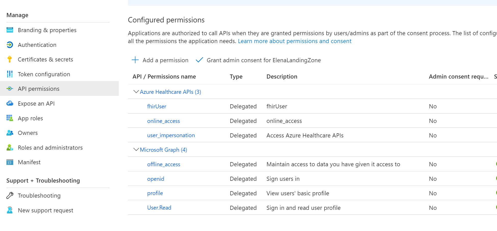

# GPT FHIR Explorer
Demonstration using OpenAI to generate FHIR Queries for exploring FHIR Server data and summarizing that data.  You may also use it as a general GPT prompt response platform.

Note: Enable CORS on FHIR Server

# How to set-up a demo environment
1.  Download and install [nodejs](https://nodejs.org/en/download) for your platform
2.  Switch to root directory of this repo
3.  Run ```npm install```
4.  Provide the following JSON Configuration object info as a single string environment variable named NODE_CONFIG: 
```
{
	"aiConfig": {
		"aiResourceName": "<your open ai resource name>",
		"aiDeploymentName": "<your open ai deployment name>",
		"aiAPIVersion": "<your open ai api version>",
		"aiKey": "<your open ai key>"
	},
	"fhirConfig": {
		"fhirEndpoint": "<your fhir server endpoint URL>"
	},
	"authConfig": {
		"clientId": "<your fhir server client id>",
		"authority": "<your fhir server client authority>",
		"redirectUri": "<your fhir server client redirect URL>"
	}
}
```
Note: example in `nodeconfig.json`
5. Run ```npm start```


## Setup FHIR Client AAD resource

AAD App Registration that is used for access to FHIR Server and OAuth setup needs to have
- SPA redirect URLs registered 
- Access and ID tokens enabled
- API permissions granted to access Graph and Azure Healthcare APIs
